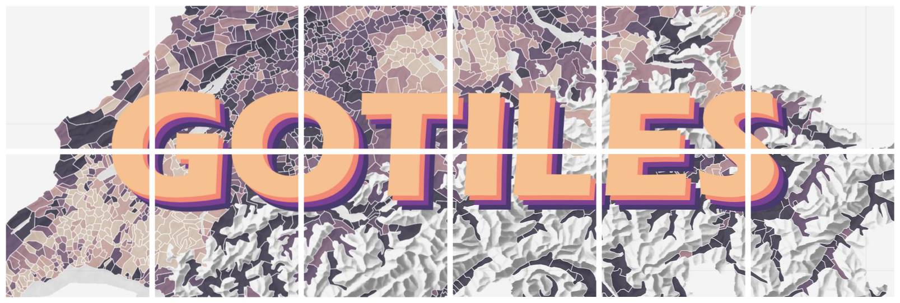

# 
Map tile generator for tiling square map images.

## Usage

```go
package main

import "github.com/coalaura/gotiles"

func main() {
    // Create a new tile generator and load an image
    tg, err := gotile.NewTileGenerator("my-cool-map.png")
    if err != nil {
        panic(err)
    }

    // Generate map tiles -> ./tiles/{z}/{x}/{y}.jpg
    err = tg.Generate(0, 6, gotile.TileOptions{
        Verbose:       true, // Print progress information to stdout
        UseCompressor: true, // Compress resulting webp files
    })
    if err != nil {
        panic(err)
    }

    // Optionally you can create a .tar.gz file of the tiles directory (requires tar to be installed)
    err = tg.CompressTileFolder(false /* Verbose parameter same as above */)
    if err != nil {
        panic(err)
    }
}
```